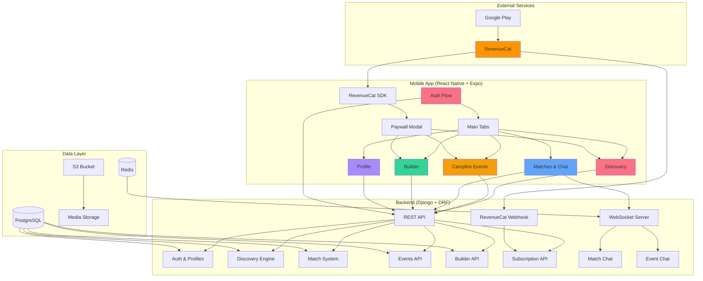

<div align="center">
  
  
  # VanlifeVibes
  
  **Connect with nomads, van lifers, and travelers on the road**
  
  [](https://www.revenuecat.com/shipyard/)
  [](https://www.djangoproject.com/)
  [](https://reactnative.dev/)
  [](https://expo.dev/)
  
</div>

---

## 🚐 About

VanlifeVibes is a mobile-first social network and dating app designed exclusively for van lifers, nomadic travelers, and digital nomads. It solves the unique challenge of making meaningful connections when you're always on the move.

### The Problem

Traditional dating apps fail nomads because they assume you're staying put. Van lifers need to connect with other travelers who understand the lifestyle and share their routes — not locals who are rooted in one place.

### The Solution

VanlifeVibes lets you:
- **Match based on travel timing** — see who's in your city now, next week, or next month
- **Connect with fellow nomads** — date or make friends with people who get the lifestyle
- **Join local events** — find hiking buddies, coffee meetups, and campfire socials
- **Get help with your build** — access a marketplace of van builders and DIY experts
- **Showcase your rig** — share photos and specs of your van, RV, or skoolie

## ✨ Features

### 🎯 Core Features

- **Smart Discovery Feed** — Swipe-based matching with relevance scoring based on location overlap, shared hobbies, and lifestyle compatibility
- **Dual Intent Matching** — Separate feeds for dating and making friends, with bidirectional gender preference filtering
- **Location Timing** — Set where you are now, next week, and next month to find travelers on similar routes
- **Overlap Detection** — See exactly when and where your paths will cross with potential matches
- **Real-Time Chat** — WebSocket-powered messaging with icebreakers and mini-cards per match
- **Profile Prompts** — Answer travel-themed questions to showcase your personality
- **Vehicle Showcase** — Display your van/RV with photos, specs, and build status

### 🔥 Campfire Events (Premium)

- **Direct-Join Events** — Create instant meetups (coffee, hiking, coworking)
- **Swipe-to-Join Events** — Host curated gatherings with approval-based attendance
- **Platform-Hosted Events** — Auto-generated community events in popular nomad hubs
- **Group Chat** — Real-time messaging unlocks when you join an event
- **Event Discovery** — Filter by type, location, and date

### 🔧 Builder Marketplace (Premium)

- **Offer Services** — Electricians, plumbers, carpenters, and solar experts list their skills
- **Request Help** — Post your van build challenges and get matched with experts
- **Location-Based** — Find builders in your current city or upcoming stops
- **Direct Messaging** — Chat with builders to discuss projects and pricing

### 💎 Premium Subscription

**Free Tier:**
- 3 swipes per day (dating + friends combined)
- Basic profile and matching
- View matches and chat

**Premium ($4.99/mo via RevenueCat):**
- Unlimited swipes
- Future location matching (next week, next month)
- Access to Campfire Events
- Access to Builder Marketplace
- Priority in discovery feeds

## 🏗️ Architecture



## 🎨 Design System

**DesertSunrise** — Optimistic, warm, and expansive outdoor aesthetic

- **Warm Neutrals** — Sand and clay tones with sunrise gradients (peach, amber, rust)
- **Sunrise Accents** — Warm gradient fills for primary actions
- **Layered Elevation** — Gentle shadows with large rounded corners
- **Breathable Spacing** — Generous vertical rhythm for relaxed feel
- **Mobile-First** — Designed exclusively for phone form factor

## Tech Stack

- **Backend**: Django 5.2, Django REST Framework, Django Channels (WebSocket), PostgreSQL
- **Mobile App**: React Native (Expo 54), React Navigation, Axios
- **Auth**: Token-based auth via DRF + django-allauth for email verification
- **Payments**: RevenueCat (`react-native-purchases`) with Google Play Billing
- **Storage**: S3 via django-storages (production), local filesystem (development)
- **ASGI Server**: Daphne (production)
- **Deployment**: AWS Elastic Beanstalk (Docker)
- **Package Managers**: UV (Python), npm (mobile)

## Project Structure

```
├── core/                # Django app (models, views, serializers, services, tests)
├── vanlifevibes/        # Django project settings, URLs, ASGI config
├── mobile-app/          # React Native / Expo app (Android)
│   ├── src/
│   │   ├── components/  # Reusable UI (SwipeDeck, PaywallModal, SwipeCounter, etc.)
│   │   ├── contexts/    # AuthContext
│   │   ├── navigation/  # React Navigation stacks and tabs
│   │   ├── screens/     # App screens (Discovery, Matches, Profile, Events, etc.)
│   │   ├── services/    # API client, RevenueCat, WebSocket
│   │   └── theme/       # Colors and styling constants
│   └── App.js           # Entry point
├── templates/           # Django email templates (allauth)
├── .ebextensions/       # Elastic Beanstalk config
├── Dockerfile           # Production Docker image
├── entrypoint.sh        # Container entrypoint (migrate + Daphne)
├── DEPLOYMENT.md        # EB deployment guide
└── manage.py            # Django entrypoint
```

## Quick Start

### 1. Install Dependencies

```bash
# Python dependencies
uv sync

# Mobile app dependencies
cd mobile-app && npm install && cd ..
```

### 2. Configure Environment

```bash
# Backend
cp .env.example .env
# Edit .env with your database credentials

# Mobile app
cd mobile-app
cp .env.example .env
# Edit .env with your LAN IP
cd ..
```

### 3. Setup Database

```bash
psql -U postgres -c "CREATE DATABASE vanlifevibes;"
uv run python manage.py migrate
uv run python manage.py createsuperuser
```

### 4. Start Development

```bash
# Terminal 1 — Backend (bind to LAN for mobile access)
uv run python manage.py runserver 0.0.0.0:8000

# Terminal 2 — Mobile app
cd mobile-app && npx expo start --lan
```

### 5. Access

- **API**: http://localhost:8000/api/v1
- **Admin Panel**: http://localhost:8000/admin
- **Mobile over LAN**: http://\<your-lan-ip\>:8000/api/v1

## API Endpoints

**Auth**
- `POST /api/v1/auth/signup/` – Register
- `POST /api/v1/auth/login/` – Login
- `POST /api/v1/auth/logout/` – Logout
- `GET /api/v1/auth/me/` – Current user

**Profiles**
- `GET /api/v1/profiles/me/` – My profile
- `PATCH /api/v1/profiles/me/` – Update profile
- `GET /api/v1/profiles/:id/` – View profile

**Discovery**
- `GET /api/v1/discovery/dating/` – Dating feed
- `GET /api/v1/discovery/friends/` – Friends feed
- `POST /api/v1/discovery/swipe/` – Cast swipe

**Matches**
- `GET /api/v1/matches/` – List matches
- `GET /api/v1/matches/:id/messages/` – Match messages
- `POST /api/v1/matches/:id/messages/` – Send message

**Events**
- `GET /api/v1/events/` – List events
- `POST /api/v1/events/` – Create event

**Subscription**
- `GET /api/v1/subscription/status/` – Subscription status
- `POST /api/v1/webhooks/revenuecat/` – RevenueCat webhook

**Health**
- `GET /api/v1/health/` – Health check (used by EB)

## Testing

```bash
# All backend tests
uv run python manage.py test core.tests

# Or use the helper script
./run-tests.sh
```

## Deployment

See [DEPLOYMENT.md](DEPLOYMENT.md) for the full Elastic Beanstalk deployment guide.

## Mobile App Troubleshooting

If the mobile app can't reach the backend:

1. Start Django bound to LAN: `uv run python manage.py runserver 0.0.0.0:8000`
2. Set `EXPO_PUBLIC_API_BASE_URL=http://<your-lan-ip>:8000/api/v1` in `mobile-app/.env`
3. Restart Expo with cache clear: `cd mobile-app && npx expo start --lan -c`
4. Confirm phone and laptop are on the same Wi-Fi network
5. Test from phone browser: `http://<your-lan-ip>:8000/api/v1/auth/login/` (a 404/405 confirms connectivity)
